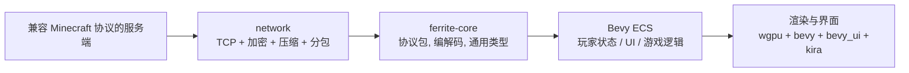

# Ferrite

Rust 编写的 Minecraft

## 当前架构

仓库按「共享协议层」与「客户端运行时」拆分：

- 详细说明见 [ARCHITECTURE.md](ARCHITECTURE.md)。



### 工作区划分

- [crates/ferrite-core](crates/ferrite-core) — 共享协议模型和基础工具：NBT、Block、Chunk、Position、协议包定义、VarInt/字符串/UUID 编解码。
- [crates/network](crates/network) — 网络连接、加密、压缩、帧处理和登录/配置/游戏状态机。
- [crates/ferrite-gui](crates/ferrite-gui) — UI、玩家控制、世界管理、LAN 发现的共享类型和系统，被 client 和 server-cli 共用。
- [crates/client](crates/client) — 客户端运行时：Bevy App、网络连接、ECS 状态、渲染与输入。
- [crates/server-cli](crates/server-cli) — 服务器命令行工具：ping、status、scan-lan、serve（启动本地 FerrumC 服务端）。
- [crates/mc-launcher-cli](crates/mc-launcher-cli) — 原版 Minecraft 启动器，用于兼容性测试。支持自动下载依赖、资源文件，启动任意版本客户端。
- [crates/mc-src-cli](crates/mc-src-cli) — 原版 Minecraft 反编译工具，用 CFR 将 jar 解码为可读 Java 源码，供协议开发参考。

### 运行链路

1. [crates/client/src/main.rs](crates/client/src/main.rs) 初始化日志、Bevy App，并可选执行自动连接。
2. [crates/client/src/game.rs](crates/client/src/game.rs) 组装游戏插件，挂载网络、玩家、UI 模块。
3. [crates/client/src/net_plugin.rs](crates/client/src/net_plugin.rs) 管理网络任务、事件轮询和 ECS 状态同步。

### 设计原则

- 通用协议字节编解码放在 ferrite-core，避免 client 重复实现。
- 加密、压缩、读取网络帧等传输层逻辑放在 network。
- 业务状态通过 Bevy ECS 和消息通道在网络层与渲染/UI 层之间流动。

## 技术栈

| 领域 | 选型 |
|------|------|
| ECS | bevy_ecs / Bevy |
| 渲染 | wgpu |
| UI | bevy_ui |
| 音频 | kira |
| 网络 | tokio |
| 序列化 | serde |
| 日志 | tracing |
| 错误处理 | anyhow + thiserror |

## 运行

```bash
# 发行版启动客户端
npm run start
# or
bun run start

# 启动本地开发服务端（FerrumC），自动查找/构建并启动
npm run server

# 指定端口
npm run server -- --port 25566

# 强制重新构建后再启动
npm run server -- --rebuild
```

### 兼容性测试

```bash
# 启动原版 1.21.8 客户端（需 JDK 21+）
bun run test:vanilla -- --username YourName
```

### 反编译参考源码

```bash
# 反编译 1.21.8 到 mc-src/1.21.8/
bun run decompile
```

其他命令请查看 [package.json](package.json)。

## 依赖服务端

客户端需要一个兼容 Minecraft 协议的服务端。当前开发使用 [FerrumC](https://github.com/sweattypalms/ferrumc)（git submodule）。

```bash
# 启动本地服务端（自动查找已有二进制或构建）
npm run server
```

`server-cli serve` 会自动搜索 `./ferrite-server`、`ferrumc/target/release/ferrumc`、`PATH` 中的二进制，找不到时执行 `cargo build -p ferrumc --release` 并复制到 `./ferrite-server`。
